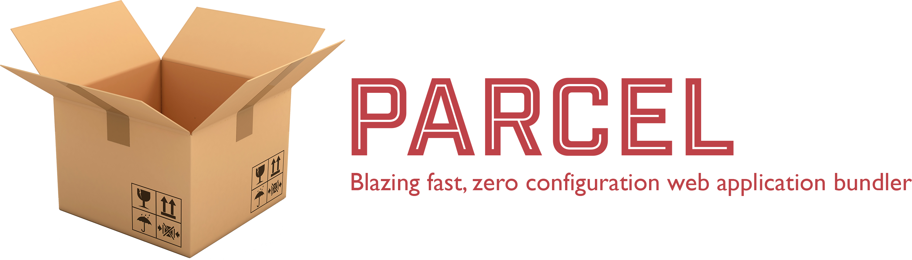

# Parceljs Primeiros Passos

> "Parcel é um empacotador de aplicações web, diferenciado pela experiência do 
> desenvolvedor. Ele oferece uma performance extremamente rápida utilizando 
> processamento multicore, sem a necessidade de configuração."

https://parceljs.org/getting_started.html

Instale o Parcel.

    yarn global add parcel-bundler
    npm install -g parcel-bundler

Para executar basta `parcel index.html`

Veja resultado em http://localhost:1234/

Repare que ele criar uma pasta chamada `/dist`.
